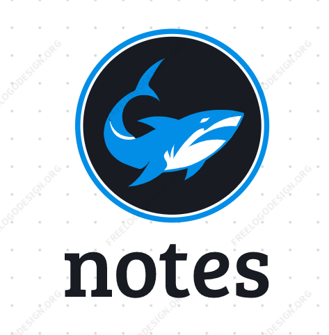

  

<h1 align = "center">Notes App</h1>

Complete Web application

 
This is a simple HTML, CSS, JS based notes writing app which act as the reminders later on. In this note app, users can easily add, edit, or delete their notes. The notes user has added to this app will be stored in the browser's local storage so, they won't remove on page refresh or tab close. This app is going to help the users to keep track of their important notes and help them reminding the importance of this application which helped them through this. 
  

### Theme
The theme of this application is quite simple and is a single colored theme. The basic colors that helped building this site's theme are : 
- Background Color: `#12134E`
- Text Color: `#ccc`
  

## Features
  

## Resources
Following are some of the resources used in this project:
- [Box Icons](https://boxicons.com/usage#import-css) for making our UI quite interactive.
- [Actionable color Palletter](https://colorpalettes.colorion.co/#26) has helped me choosing the theme for this site.
  

## Demo
  

## Link To Video
  

## GUI
  

## Technology Stack
Following tecnologies has helped me making this project a fine work:
- HTML
- CSS
  

## Advancement
  

## Deployment
  

## Developer
Muhammad Abdullah Butt  
abdullahbutt12292210@gmail.com  
> [Instagram](https://www.instagram.com/abdullah.butt.22/) 
> [FaceBook](https://www.facebook.com/profile.php?id=100076291614529) 
> [YouTube](https://www.youtube.com/channel/UCnuOFQyMywg-KuoN-lmav1Q) 
> [Portfolio](https://rebrand.ly/muhammadabdullahPortfolio) 
> [Website](#)
